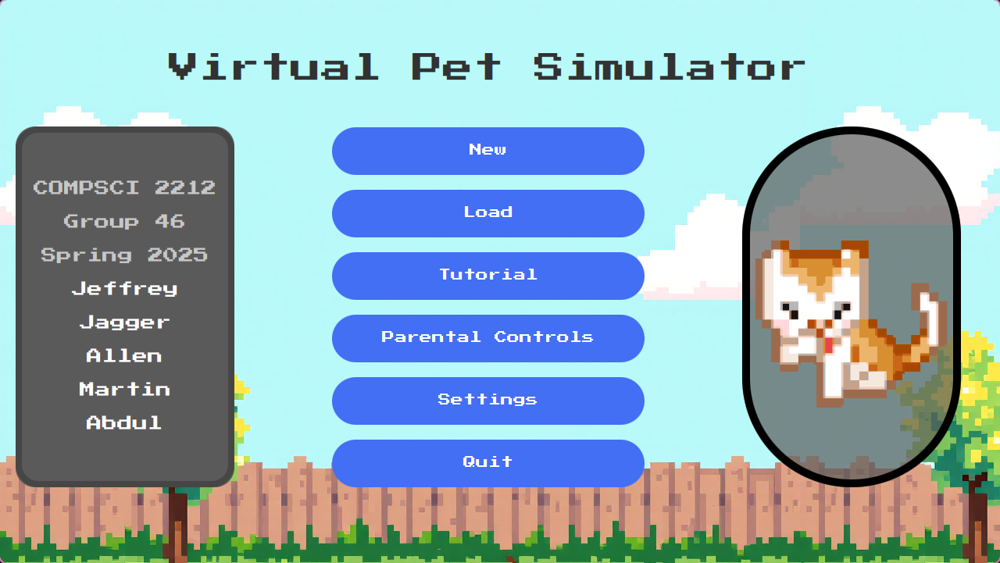

# Description
Virtual Pet simulator is a simple virtual pet simulator built with JavaFX and Maven. 
This lightweight application lets users adopt and care for a digital pet through an intuitive graphical interface.
Key Features:

- Feed your pet to maintain its hunger level
- Play with your pet to keep it happy
- Watch your pet's mood and health change based on your interactions
- Simple, clean interface suitable for all ages

The simulator uses JavaFX for the graphical components and Maven for dependency management and build automation, making it easy to run on multiple platforms.


# Installation
You must have java 21+ installed on your machine to run the program

**Running Instance on local machine through IDE**
```
git clone https://gitlab.sci.uwo.ca/courses/2025/01/COMPSCI2212/group46
```

Open group46 inside an IDE of your choice and run the App.java file under src/main/java/com/group46/

**Running Instance on local machine through terminal**

You can download the virtual_pet-1.jar jar file from under the jar_files directory in the repo and run
```
java -jar virtual_pet-1.jar
```


**Important:**
Calculate afk function inside of play class is disabled due to poor optimizations


# Parental Controls
Password: 1234

# JavaDoc Website
To access the JavaDoc website open the javadoc folder and open the index.html file inside a browser

**Windows**

through IDE/file explorer: Navigate to the to JavaDoc folder from the cloned repository, right click the index.html file and open with google or your preferred browser.


**Arch linux**

Through terminal:

Once the repo has been cloned run

```
cd group46/javadoc
google-chrome-stable index.html
```

To access JavaDoc website


# Tech
- javafx 21(UI)
- maven 21(build tool)
- jackson 2.15.2(json)

Maven automatically installs dependencies inside of the pom.xml file. Just run the app file in the IDE and it'll install it for you. Intellij is recommended.

# Compiling
In Intellij, go to view -> tool window -> maven, then in the maven panel under lifecycle run clean then run intall.
This will create an executable jar file in the target directory.


